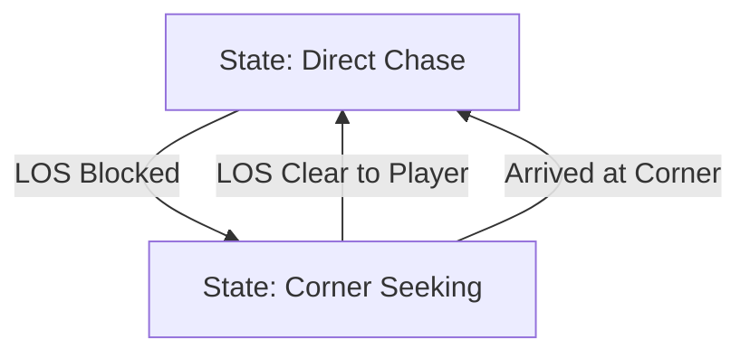

# Technical Specification: Corner Navigation (Approach A)

This document outlines the pathfinding logic for the `Enemy` class to navigate around obstacles using a visibility-based "Corner Navigation" strategy.

## 1. Line-Rectangle Intersection (`lineRectIntersect`)

To determine if an enemy has a clear line of sight to the player or a corner, we need an efficient check against rectangular walls.

### Logic
A line segment intersects a rectangle if it intersects any of the four line segments forming the rectangle's boundaries. However, for AABB (Axis-Aligned Bounding Boxes), we can use the **Liang-Barsky** algorithm or a simplified segment-clipping approach.

### Pseudocode
```javascript
function lineRectIntersect(x1, y1, x2, y2, rect) {
    let left = rect.x;
    let right = rect.x + rect.w;
    let top = rect.y;
    let bottom = rect.y + rect.h;

    // Use Cohen-Sutherland or simple parametric intersection
    let tmin = 0, tmax = 1;
    let dx = x2 - x1;
    let dy = y2 - y1;

    // Check X boundaries
    if (dx !== 0) {
        let t1 = (left - x1) / dx;
        let t2 = (right - x1) / dx;
        tmin = Math.max(tmin, Math.min(t1, t2));
        tmax = Math.min(tmax, Math.max(t1, t2));
    } else if (x1 < left || x1 > right) return false;

    // Check Y boundaries
    if (dy !== 0) {
        let t1 = (top - y1) / dy;
        let t2 = (bottom - y1) / dy;
        tmin = Math.max(tmin, Math.min(t1, t2));
        tmax = Math.min(tmax, Math.max(t1, t2));
    } else if (y1 < top || y1 > bottom) return false;

    return tmax >= tmin;
}
```

---

## 2. Corner Selection Logic (`getVisibleCorners`)

When the direct path to the player is blocked, the enemy identifies "stepping stone" corners.

### Mathematical Approach
1.  **Identify Blocking Wall**: Check which wall(s) intersect the line between `Enemy` and `Player`.
2.  **Gather Potential Corners**: Iterate through all walls (as per robustness requirement). Each rectangle has 4 corners.
3.  **Visibility Filter**: A corner is valid ONLY if:
    *   Line of sight from `Enemy` to `Corner` is CLEAR.
    *   Line of sight from `Corner` to `Player` is CLEAR (Optional: simpler version just checks if Corner is "closer" to player or provides progress).
4.  **Optimal Corner**: Choose the corner that minimizes `Distance(Enemy, Corner) + Distance(Corner, Player)`.

---

## 3. Offset Logic (The "Safe Spot")

To prevent the enemy (which has a radius) from clipping into walls while rounding corners, we calculate an offset target point.

### Calculation
Given a corner $(Cx, Cy)$ and its associated rectangle:
1.  Determine the "corner type" (Top-Left, Top-Right, Bottom-Left, Bottom-Right).
2.  Apply an offset of `Enemy.radius + Padding` (e.g., 5-10 pixels) outwards from the center of the rectangle.

| Corner Type | Offset Direction |
| :--- | :--- |
| Top-Left | $(-1, -1)$ |
| Top-Right | $(1, -1)$ |
| Bottom-Left | $(-1, 1)$ |
| Bottom-Right | $(1, 1)$ |

**Target Point**: $P_{target} = (Cx + OffsetX, Cy + OffsetY)$

---

## 4. `Enemy.update(dt)` Integration

The enemy will operate as a simple state machine to toggle between direct chasing and corner seeking.

### State Transitions


### Integration Pseudocode
```javascript
update(dt) {
    let hasLOS = true;
    for (let w of walls) {
        if (lineRectIntersect(this.x, this.y, player.x, player.y, w)) {
            hasLOS = false;
            break;
        }
    }

    if (hasLOS) {
        this.target = { x: player.x, y: player.y };
    } else {
        // Find best corner if we don't have a valid one or LOS changed
        if (!this.cornerPath) {
            this.target = findBestCorner(this, player, walls);
        }
    }

    // Move towards this.target...
    moveTowards(this.target, dt);
}
```

---

## 5. Performance Considerations
*   **Caching**: Re-calculate `getVisibleCorners` only once every few frames or when LOS status changes.
*   **Early Exit**: In `lineRectIntersect`, return `false` as soon as a boundary check fails.
